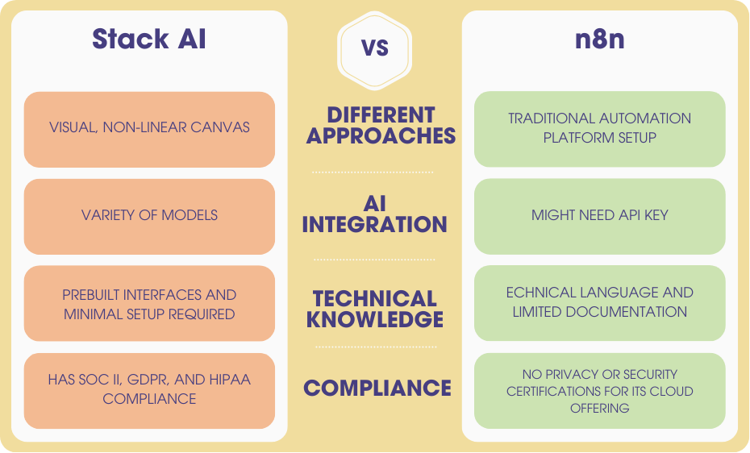

# **Stack AI Platform Review: Experience and Insights from an Implementation Perspective**

  
   
  <em>Figure 1: Stack AI, Retrieved from https://www.google.com/url?sa=i&url=https%3A%2F%2Fwww.stack-ai.com%2Fpricing&psig=AOvVaw1f-3GlX68Iq48sS7qqYdmL&ust=1747098311446000&source=images&cd=vfe&opi=89978449&ved=0CBEQjRxqFwoTCJCxhcTenI0DFQAAAAAdAAAAABAI</em>

## **Introduction**

The tech industry is witnessing a significant shift with the rise of AI workflow platforms, tools that enable organizations to implement artificial intelligence solutions without requiring specialized development teams. These platforms are transforming how businesses approach AI adoption, making powerful capabilities accessible to teams regardless of their coding expertise.

Stack AI represents a new generation of enterprise AI platforms specifically designed for creating sophisticated AI workflows through a visual, no-code approach.

This blog aims to share hands-on experience about building a job recommender system using Stack AI's knowledge base workflow. I'll provide a balanced perspective that covers both the strengths and limitations I encountered throughout the development process. By documenting this journey, I hope to offer practical insights for others considering similar projects or exploring AI workflow platforms.

## **What is Stack AI?**

Stack AI was co-founded by Bernardo Aceituno and Antoni Rosinol, both former PhD students at MIT. According to industry reporting, the founders identified the potential of large language models before ChatGPT's release, recognizing a market gap for tools that could effectively combine data with these powerful AI models.
At its foundation, Stack AI functions as a low-code workflow automation tool specifically designed for AI applications. The platform's architecture enables users to build AI-driven workflows through an intuitive drag-and-drop interface[Stack AI: What It Is and Best Alternatives [Review]](https://www.voiceflow.com/blog/stack-ai).

## **Key Features of the Platform**

Based on my research and hands-on experience, Stack AI offers several distinctive features:

### **Drag-and-Drop Visual Workflow Builder**

The centerpiece of Stack AI is its visual interface that allows users to construct AI workflows without writing code. When testing the platform, I found this interface particularly intuitive, with clearly labeled components and a logical organization that makes it approachable even for those without technical backgrounds.

### **Integration with Multiple AI Models**

Stack AI provides access to a variety of large language models from different providers. According to their comparison with Microsoft Copilot Studio, "Stack AI integrates with all the leading LLMs on the market, including OpenAI, Anthropic, Google, Meta and many others" [Microsoft Copilot Studio vs. Stack AI: A Comprehensive Comparison | Stack AI · The Platform for Enterprise AI](https://www.stack-ai.com/blog/microsoft-copilot-studio-versus-stack-ai). This flexibility allows users to select the optimal model for specific use cases.

### **Knowledge Base Creation Tools**

The platform offers capabilities for creating and managing knowledge bases from various data sources. These knowledge bases serve as the foundation for AI applications, providing the context necessary for generating accurate and relevant responses.

### **Ready-to-Use Templates**

Stack AI provides a library of pre-built templates based on real-world use cases, which allow users to achieve immediate results and customize to their needs. During my project, I found these templates valuable for quickly establishing a functional foundation.

### **Deployment Options**

The platform supports multiple deployment methods, including API endpoints and customizable user interfaces. This flexibility allows AI workflows to be integrated into existing systems or deployed as standalone applications.

## **Hands-On Experience: Building a Workflow with Stack AI**

For my evaluation of Stack AI, I chose to build a job recommender system as a demonstration project. This system would serve as an AI Career Assistant focused on helping job seekers find relevant AI positions in the technology, media, and telecommunications (TMT) industry.

The system's core functionality would include analyzing uploaded resumes to identify key skills and qualifications, matching candidate profiles with current job listings from seek.au, providing personalized job recommendations with explanations of fit, and offering advice for improving applications and addressing skill gaps.

This use case was selected because it incorporates several key AI capabilities: document analysis, pattern matching, recommendation generation, and natural language explanation - making it an ideal test case for evaluating Stack AI's functionality.

## **Implementation Approach**

Building this system with Stack AI involved a straightforward workflow leveraging the platform's visual interface:

### **Knowledge Base Creation**

The first step was establishing a knowledge base of job listings using Stack AI's Website node. This involved setting up connections to retrieve job data from seek.au, organizing the information into a structured format for efficient querying, and creating a workflow for maintaining up-to-date job information.

### **AI Model Integration**

The core intelligence of the system relied on Stack AI's LLM integration. I implemented a workflow to analyze resume documents using Claude or GPT models and created system prompts to extract relevant skills and experience information. This was followed by developing matching logic to compare resume content against job requirements and setting up a recommendation system to rank and explain potential matches.

### **User Interface**

For the user experience, I configured a simple upload mechanism for resumes and designed a clear presentation format for job recommendations. The interface included explanations of why each position was recommended along with suggestions for improving job applications to better match requirements.

The entire implementation was completed using Stack AI's visual workflow builder without requiring custom code, demonstrating the platform's accessibility for non-technical users. While simple, this prototype effectively demonstrated how Stack AI can be used to create functional AI applications that solve real business problems.

## **User Experience with Stack AI**

Now I'll focus on the critical aspects of my hands-on experience using Stack AI to build the job recommender system. This section will provide practical insights into what it's actually like to use the platform.

### **Intuitive Interface**

Stack AI's user interface proved to be one of its strongest features, particularly for someone approaching the platform without extensive technical expertise. The visual workflow builder presents a clean, logical layout that makes the process of constructing AI workflows remarkably straightforward.

In my experience, the platform excels at abstracting away complexity without sacrificing functionality. Unlike more technical alternatives like n8n, Stack AI follows familiar SaaS design patterns that business professionals will recognize immediately. The node categories are logically organized, with descriptive labels that clearly communicate their purpose without requiring technical knowledge.

The hover tooltips and contextual help provided timely guidance exactly when needed, reducing the learning curve significantly. This thoughtful design enabled me to focus on building the job recommender logic rather than struggling with the interface itself.

### **Templates and Quick Start**

While there wasn't a specific job recommender template available, I was able to adapt the knowledge base assistant template as a starting point. This approach saved considerable time compared to building from scratch and provided insight into best practices for structuring AI workflows.

### **Limitations of the Free Plan**

While Stack AI offers an impressive set of features, I encountered several significant limitations with the free plan that impacted my project's development. The most immediate constraint was the allowance of only 100 runs per month and a maximum of 1 project, which I found depleted quickly during development and testing.

Feature restrictions were equally limiting, particularly the inability to incorporate custom Python code, which significantly constrained the sophistication of the matching algorithms I could implement.

Data integration presented another hurdle, with limited options for connecting to custom data sources and APIs, complicating the creation of a comprehensive database.

Perhaps most importantly, as the project progressed, it became increasingly clear that scaling to a production-ready system would require upgrading to a paid tier to access essential features like improved performance, increased reliability, and technical support. These limitations position Stack AI's free tier as suitable for proof-of-concept work and learning the platform, but inadequate for extensive development or production use.

### **Potential Enhancements with Pro Plan**

The free plan allowed me to create a basic prototype, but a production-ready system would benefit significantly from features available in Stack AI's paid tiers.

Python scripting stands out as perhaps the most valuable premium feature, enabling more sophisticated processing of resumes and job listings. With custom code, I could implement advanced matching algorithms that go beyond simple keyword matching to understand semantic relationships between different but related skills.

The Pro plan would also unlock expanded data integration capabilities, allowing direct connections to multiple job boards and existing resume repositories for more comprehensive coverage. This would provide a broader view of available positions and enable comparative analysis against industry standards.

The user experience could be significantly enhanced through custom UI development, creating a branded interface with interactive features like skill comparison charts and application tracking. For deployment at scale, the Pro plan offers essential operational features including increased run limits to handle peak usage, enhanced security for sensitive resume information, and compliance tools to ensure adherence to employment regulations.

Advanced analytics would transform the system from a simple matching tool into a strategic resource by tracking usage patterns, monitoring application success rates, and aggregating data on common skill deficiencies to identify training opportunities.

These enhancements highlight Stack AI's tiered approach to feature access -- while the free plan demonstrates basic capabilities, unlocking the platform's full potential for sophisticated applications requires investment in premium features.

## **Stack AI vs. n8n**

_The Comparison chart for stack AI and n8n_

## **Use Cases**

Stack AI serves a wide range of enterprise applications:

* **Intelligent Assistants and Chatbots**: Build customized AI agents that answer employee questions about company policies or help customers navigate product offerings. These can be deployed across channels including websites, Slack, or WhatsApp. 
* **Document Processing**: Automatically analyze contracts, extract key terms, and generate summaries from complex documents. Stack AI's template library includes specialized tools for RFP responses and contract analysis.

* **Database Insights**: Connect AI models to organizational databases for natural language querying of structured information.

* **Content Generation**: Create workflows that draft personalized emails, marketing materials, or technical documentation following specific guidelines. Users can build agents that generate content in consistent brand voice across multiple formats.

* **Healthcare Systems**: Develop HIPAA-compliant applications that access patient history and treatment plans while maintaining privacy requirements. Healthcare providers can query an AI system with questions about patient history, treatment plans, and progress.

* **Process Automation**: Streamline back-office functions and routine business processes to improve operational efficiency. Stack AI enables teams to automate workflows "allowing professionals to focus on impactful tasks that drive business growth".

## **Conclusion**

Stack AI offers a promising platform for businesses seeking to implement AI solutions without extensive technical expertise. Through my experience building a job recommender system, I found the platform's intuitive interface and pre-built templates accelerated development significantly, while the visual workflow builder made complex AI processes accessible to non-developers.

Despite the free tier's limitations in storage, runs, and feature availability, Stack AI demonstrated considerable potential for prototyping AI workflows. For production environments, the premium plans would be necessary to unlock essential features. For organizations looking to deploy AI solutions quickly without expanding their technical teams, Stack AI represents a valuable balance of accessibility and capability.

Despite the free tier's limitations in storage, runs, and feature availability, Stack AI demonstrated considerable potential for prototyping AI workflows. For production environments, the premium plans would be necessary to unlock essential features. For organizations looking to deploy AI solutions quickly without expanding their technical teams, Stack AI represents a valuable balance of accessibility and capability.

# **Stack AI Platform Review: Experience and Insights from an Implementation Perspective**

<!-- 
To add images to this document:
1. Create an 'images' folder in your repository
2. Upload image files to that folder
3. Reference them using this syntax:
   
   *Caption: Descriptive caption for the image*

For side-by-side images:

  
  

<em>Left: Description of first image. Right: Description of second image</em>

-->

## **Introduction**

The tech industry is witnessing a significant shift with the rise of AI workflow platforms, tools that enable organizations to implement artificial intelligence solutions without requiring specialized development teams. These platforms are transforming how businesses approach AI adoption, making powerful capabilities accessible to teams regardless of their coding expertise.

Stack AI represents a new generation of enterprise AI platforms specifically designed for creating sophisticated AI workflows through a visual, no-code approach.

This blog aims to share hands-on experience about building a job recommender system using Stack AI's knowledge base workflow. I'll provide a balanced perspective that covers both the strengths and limitations I encountered throughout the development process. By documenting this journey, I hope to offer practical insights for others considering similar projects or exploring AI workflow platforms.

## **What is Stack AI?**

Stack AI was co-founded by Bernardo Aceituno and Antoni Rosinol, both former PhD students at MIT. According to industry reporting, the founders identified the potential of large language models before ChatGPT's release, recognizing a market gap for tools that could effectively combine data with these powerful AI models [Source: Review of Stack AI] [Stack AI: What It Is and Best Alternatives [Review]](https://www.voiceflow.com/blog/stack-ai).

At its foundation, Stack AI functions as a low-code workflow automation tool specifically designed for AI applications. The platform's architecture enables users to build AI-driven workflows through an intuitive drag-and-drop interface [Source: Review of Stack AI] [Stack AI: What It Is and Best Alternatives [Review]](https://www.voiceflow.com/blog/stack-ai).

## **Key Features of the Platform**

Based on my research and hands-on experience, Stack AI offers several distinctive features:

### **Drag-and-Drop Visual Workflow Builder**

The centerpiece of Stack AI is its visual interface that allows users to construct AI workflows without writing code. When testing the platform, I found this interface particularly intuitive, with clearly labeled components and a logical organization that makes it approachable even for those without technical backgrounds.

### **Integration with Multiple AI Models**

Stack AI provides access to a variety of large language models from different providers. According to their comparison with Microsoft Copilot Studio, "Stack AI integrates with all the leading LLMs on the market, including OpenAI, Anthropic, Google, Meta and many others" [Source: Stack AI blog] [Microsoft Copilot Studio vs. Stack AI: A Comprehensive Comparison | Stack AI · The Platform for Enterprise AI](https://www.stack-ai.com/blog/microsoft-copilot-studio-versus-stack-ai). This flexibility allows users to select the optimal model for specific use cases.

### **Knowledge Base Creation Tools**

The platform offers capabilities for creating and managing knowledge bases from various data sources. These knowledge bases serve as the foundation for AI applications, providing the context necessary for generating accurate and relevant responses.

### **Ready-to-Use Templates**

Stack AI provides a library of pre-built templates based on real-world use cases. According to their website, these allow users to "achieve immediate results and customize to your needs" [Source: Stack AI website] [Build AI Agents with the Enterprise AI Platform | Stack AI](https://www.stack-ai.com/). During my project, I found these templates valuable for quickly establishing a functional foundation.

### **Deployment Options**

The platform supports multiple deployment methods, including API endpoints and customizable user interfaces. This flexibility allows AI workflows to be integrated into existing systems or deployed as standalone applications.

## **Hands-On Experience: Building a Workflow with Stack AI**

For my evaluation of Stack AI, I chose to build a job recommender system as a demonstration project. This system would serve as an AI Career Assistant focused on helping job seekers find relevant AI positions in the technology, media, and telecommunications (TMT) industry.

The system's core functionality would include analyzing uploaded resumes to identify key skills and qualifications, matching candidate profiles with current job listings from seek.au, providing personalized job recommendations with explanations of fit, and offering advice for improving applications and addressing skill gaps.

This use case was selected because it incorporates several key AI capabilities: document analysis, pattern matching, recommendation generation, and natural language explanation - making it an ideal test case for evaluating Stack AI's functionality.

## **Implementation Approach**

Building this system with Stack AI involved a straightforward workflow leveraging the platform's visual interface:

### **Knowledge Base Creation**

The first step was establishing a knowledge base of job listings using Stack AI's Website node. This involved setting up connections to retrieve job data from seek.au, organizing the information into a structured format for efficient querying, and creating a workflow for maintaining up-to-date job information.

### **AI Model Integration**

The core intelligence of the system relied on Stack AI's LLM integration. I implemented a workflow to analyze resume documents using Claude or GPT models and created system prompts to extract relevant skills and experience information. This was followed by developing matching logic to compare resume content against job requirements and setting up a recommendation system to rank and explain potential matches.

### **User Interface**

For the user experience, I configured a simple upload mechanism for resumes and designed a clear presentation format for job recommendations. The interface included explanations of why each position was recommended along with suggestions for improving job applications to better match requirements.

The entire implementation was completed using Stack AI's visual workflow builder without requiring custom code, demonstrating the platform's accessibility for non-technical users. While simple, this prototype effectively demonstrated how Stack AI can be used to create functional AI applications that solve real business problems.

## **User Experience with Stack AI**

Now I'll focus on the critical aspects of my hands-on experience using Stack AI to build the job recommender system. This section will provide practical insights into what it's actually like to use the platform.

### **Intuitive Interface**

Stack AI's user interface proved to be one of its strongest features, particularly for someone approaching the platform without extensive technical expertise. The visual workflow builder presents a clean, logical layout that makes the process of constructing AI workflows remarkably straightforward.

In my experience, the platform excels at abstracting away complexity without sacrificing functionality. Unlike more technical alternatives like n8n, Stack AI follows familiar SaaS design patterns that business professionals will recognize immediately. The node categories are logically organized, with descriptive labels that clearly communicate their purpose without requiring technical knowledge.

The hover tooltips and contextual help provided timely guidance exactly when needed, reducing the learning curve significantly. This thoughtful design enabled me to focus on building the job recommender logic rather than struggling with the interface itself.

### **Templates and Quick Start**

One of the most valuable aspects of Stack AI was its library of pre-built templates. These templates are inspired by real use cases and allow users to achieve immediate results and customize to their needs [Build AI Agents with the Enterprise AI Platform | Stack AI](https://www.stack-ai.com/).

While there wasn't a specific job recommender template available, I was able to adapt the knowledge base assistant template as a starting point. This approach saved considerable time compared to building from scratch and provided insight into best practices for structuring AI workflows.

### **Limitations of the Free Plan**

While Stack AI offers an impressive set of features, I encountered several significant limitations with the free plan that impacted my project's development. The most immediate constraint was the allowance of only 500 runs per month and a maximum of 2 projects, which I found depleted quickly during development and testing.

Feature restrictions were equally limiting, particularly the inability to incorporate custom Python code, which significantly constrained the sophistication of the matching algorithms I could implement.

Data integration presented another hurdle, with limited options for connecting to custom data sources and APIs, complicating the creation of a comprehensive database.

Perhaps most importantly, as the project progressed, it became increasingly clear that scaling to a production-ready system would require upgrading to a paid tier to access essential features like improved performance, increased reliability, and technical support. These limitations position Stack AI's free tier as suitable for proof-of-concept work and learning the platform, but inadequate for extensive development or production use.

### **Potential Enhancements with Pro Plan**

The free plan allowed me to create a basic prototype, but a production-ready system would benefit significantly from features available in Stack AI's paid tiers.

Python scripting stands out as perhaps the most valuable premium feature, enabling more sophisticated processing of resumes and job listings. With custom code, I could implement advanced matching algorithms that go beyond simple keyword matching to understand semantic relationships between different but related skills.

The Pro plan would also unlock expanded data integration capabilities, allowing direct connections to multiple job boards and existing resume repositories for more comprehensive coverage. This would provide a broader view of available positions and enable comparative analysis against industry standards.

The user experience could be significantly enhanced through custom UI development, creating a branded interface with interactive features like skill comparison charts and application tracking. For deployment at scale, the Pro plan offers essential operational features including increased run limits to handle peak usage, enhanced security for sensitive resume information, and compliance tools to ensure adherence to employment regulations.

Advanced analytics would transform the system from a simple matching tool into a strategic resource by tracking usage patterns, monitoring application success rates, and aggregating data on common skill deficiencies to identify training opportunities.

These enhancements highlight Stack AI's tiered approach to feature access -- while the free plan demonstrates basic capabilities, unlocking the platform's full potential for sophisticated applications requires investment in premium features.

## **Use Cases Beyond Job Recommendations**

Stack AI serves a wide range of enterprise applications:

* **Intelligent Assistants and Chatbots**: Build customized AI agents that answer employee questions about company policies or help customers navigate product offerings. These can be deployed across channels including websites, Slack, or WhatsApp [Source: Stack AI Sharepoint blog] [How to build a Sharepoint AI Agent - Stack AI · Accelerate Your Mission with Intelligent AI Workflows](https://www.stack-ai.com/blog/how-to-build-a-sharepoint-ai-agent).

* **Document Processing**: Automatically analyze contracts, extract key terms, and generate summaries from complex documents. Stack AI's template library includes specialized tools for RFP responses and contract analysis [Source: Stack AI DeepSeek blog] [Building an AI Agent with DeepSeek Using StackAI - Stack AI · Accelerate Your Mission with Intelligent AI Workflows](https://www.stack-ai.com/blog/building-an-ai-agent-with-deepseek-using-stackai).

* **Database Insights**: Connect AI models to organizational databases for natural language querying of structured information. This allows non-technical users to "reduce reliance on data analytics by enabling real-time insights through natural language queries" [Source: Stack AI enterprise solutions page] [Enterprise AI Solutions | AI Agents with StackAI | Stack AI · The Platform for Enterprise AI](https://www.stack-ai.com/enterprise-ai-solutions).

* **Content Generation**: Create workflows that draft personalized emails, marketing materials, or technical documentation following specific guidelines. Users can build agents that generate content in consistent brand voice across multiple formats.

* **Healthcare Systems**: Develop HIPAA-compliant applications that access patient history and treatment plans while maintaining privacy requirements. Healthcare providers can "query an AI system with questions about patient history, treatment plans, and progress" [How to build a HIPAA-compliant AI Chatbot](https://www.stack-ai.com/blog/how-to-build-a-hipaa-compliant-chatbot).

* **Research Automation**: Implement workflows that gather information from multiple sources and synthesize findings into structured reports. Organizations use Stack AI for "conducting web research to generate investment memos" [Source: Stack AI funding announcement] [Enterprise AI Agents for Every Job: StackAI Raises $16M - Stack AI · Accelerate Your Mission with Intelligent AI Workflows](https://www.stack-ai.com/blog/enterprise-ai-agents-for-every-job-stackai-raises-16m).

* **Educational Support**: Build assistants that help students navigate coursework or assist faculty with administrative tasks. Educational institutions have successfully deployed AI assistants for their students using the platform [Source: Stack AI education solutions page] [Education AI Solutions: Enhance Learning with Stack AI | Stack AI · The Platform for Enterprise AI](https://www.stack-ai.com/education-ai-solutions).

* **Process Automation**: Streamline back-office functions and routine business processes to improve operational efficiency. Stack AI enables teams to automate workflows "allowing professionals to focus on impactful tasks that drive business growth" [Source: Stack AI website] [Build AI Agents with the Enterprise AI Platform | Stack AI](https://www.stack-ai.com/).

## **Conclusion**

Stack AI offers a promising platform for businesses seeking to implement AI solutions without extensive technical expertise. Through my experience building a job recommender system, I found the platform's intuitive interface and pre-built templates accelerated development significantly, while the visual workflow builder made complex AI processes accessible to non-developers.

Despite the free tier's limitations in storage, runs, and feature availability, Stack AI demonstrated considerable potential for prototyping AI workflows. For production environments, the premium plans would be necessary to unlock essential features. For organizations looking to deploy AI solutions quickly without expanding their technical teams, Stack AI represents a valuable balance of accessibility and capability.

## **References**

1. Stack AI. (2025). *Build AI Agents with the Enterprise AI Platform*. Retrieved from https://www.stack-ai.com/

2. Stack AI. (2025). *Microsoft Copilot Studio vs. Stack AI: A Comprehensive Comparison*. Retrieved from https://www.stack-ai.com/blog/microsoft-copilot-studio-versus-stack-ai

3. Stack AI. (2025). *AI Agents with StackAI*. Retrieved from https://www.stack-ai.com/enterprise-ai-solutions

4. Stack AI. (2025). *How to build a HIPAA-compliant AI Chatbot*. Retrieved from https://www.stack-ai.com/blog/how-to-build-a-hipaa-compliant-chatbot

5. Voiceflow. (2025). *Stack AI: What It Is and Best Alternatives [Review]*. Retrieved from https://www.voiceflow.com/blog/stack-ai
